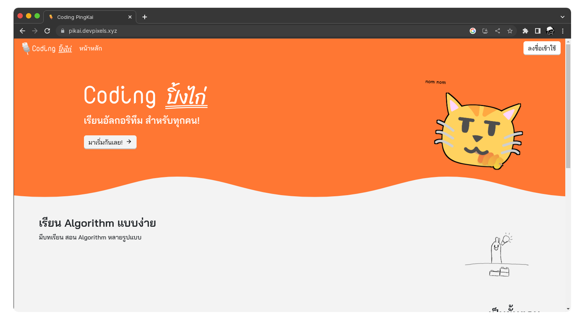
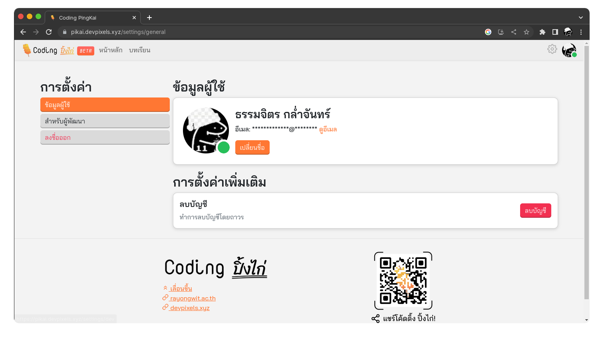

<div align="center">

<h1>โคดดิ้ง ปิ้งไก่</h1>
</div>

**โคดดิ้ง ปิ้งไก่** เป็นสื่อการสอนโปรแกรมเมอร์มือใหม่เกี่ยวกับ Algorithm ผ่านการสอน Block Coding และ Python. Web application นี้เขียนในภาษา Javascript และ Framework ชื่อ "Vue"

คุณสามารถทดลองใช้ได้แล้ว[ที่นี้](https://pikai.devpixels.xyz/)

**!!! Web Application นี้กำลังอยู่ในการพัตนา**

## Screenshots





## รันโปรแกรม/Setup
คุณต้องลงโปรแกรมดังนี้เพื่อรัน โคดดิ้ง ปิ้งไก่

| โปรแกรม | ดาวน์โหลด(Windows) |ดาวน์โหลด(Ubuntu) |
|--|--|--|
| NodeJS | https://nodejs.org/en/ | `sudo apt install nodejs` |
| npm | ลงพร้อมกับ NodeJS | `sudo apt install npm` |
| firebase-tools | `npm i firebase-tools` | `sudo npm i firebase-tools -g` |
| OpenJDK | https://learn.microsoft.com/en-us/java/openjdk/download | `sudo apt install default-jdk` |

1. โคลนโปรเจ็คต์
```sh
git clone https://github.com/SK-Fast/Coding-PingKai.git
```
2. ลง Packages
```sh
npm install
```
3. รัน Firebase Emulator
```sh
npm run emu
```
4. เปิดอีก Terminal เพื่อรันหน้า Web
```sh
npm run dev
```
5. เปิดลิงค์ที่อยู่ด้านหลัง `➜  Local`.

## Docker Container
🔨 wip

## ทีมโคดดิ้ง ปิ้งไก่
- ธรรมจิตร กล่ำจันทร์ [DevPixels](https://github.com/SK-Fast)
  > - 💻 พัฒนาแอป 🎨 ออกแบบ
- พชร เจริญศรี [BATjuiceXD](https://github.com/BATjuiceXD)
  > - 💻 พัฒนาแอป 📝 ทำเอกสาร
- นิพพิชฌน์ สำราญรณศักดิ์ [frizeto](https://github.com/frizeto)
  > - 🎨 กราฟฟิก

<hr/>
<div align="center">

[devpixels.xyz](https://devpixels.xyz)
•
[rayongwit.ac.th](https://rayongwit.ac.th)


</div>